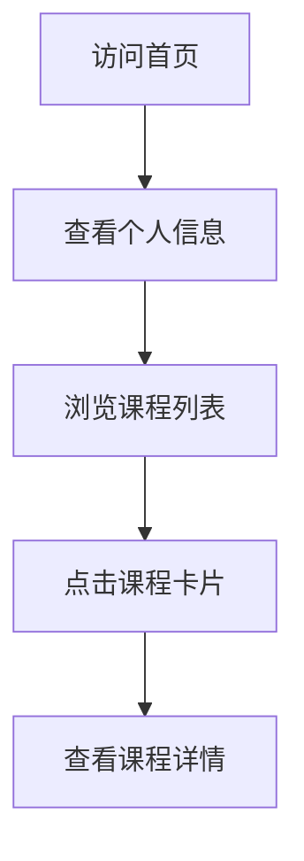

## 1. Product Overview
个人课程展示页面，用于展示广东科学技术职业学院商学院商务数据分析与应用专业学生李优发的课程信息。
- 主要目的是为用户提供一个清晰、美观的课程信息展示平台，方便后续补充课程内容。
- 目标用户为个人、同学、教师等需要了解课程信息的人群。

## 2. Core Features

### 2.1 User Roles
| Role | Registration Method | Core Permissions |
|------|---------------------|------------------|
| 访问者 | 无需注册 | 浏览所有课程信息 |

### 2.2 Feature Module
1. **首页**：个人信息展示、课程列表、课程卡片

### 2.3 Page Details
| Page Name | Module Name | Feature description |
|-----------|-------------|---------------------|
| 首页 | 个人信息 | 展示学生姓名、学校、专业等基本信息 |
| 首页 | 课程列表 | 以卡片形式展示多个课程信息，包括课程名称、简介等 |
| 首页 | 课程卡片 | 点击卡片可查看课程详情（后续扩展） |

## 3. Core Process
用户访问首页 → 查看个人信息 → 浏览课程列表 → 点击课程卡片查看详情（后续实现）

## 4. User Interface Design
### 4.1 Design Style
- 主色调：蓝色系（代表专业、科技感）
- 辅助色：白色、浅灰色
- 按钮风格：圆角矩形，轻微阴影
- 字体：无衬线字体，清晰易读
- 布局风格：卡片式布局，响应式设计
- 图标风格：简约现代

### 4.2 Page Design Overview
| Page Name | Module Name | UI Elements |
|-----------|-------------|-------------|
| 首页 | 个人信息 | 居中布局，包含头像、姓名、学校、专业信息，使用较大字号和适当间距 |
| 首页 | 课程列表 | 网格布局，响应式调整列数，每个课程以卡片形式展示，包含课程名称、简介、图标 |
| 首页 | 课程卡片 | 白色背景，轻微阴影，悬停效果，圆角设计，内部包含课程基本信息 |

### 4.3 Responsiveness
- 桌面优先设计，同时支持平板和移动设备
- 在小屏幕设备上自动调整布局为单列
- 触摸优化，确保在移动设备上操作流畅

### 4.4 3D Scene Guidance
- 不适用，本项目为纯静态页面