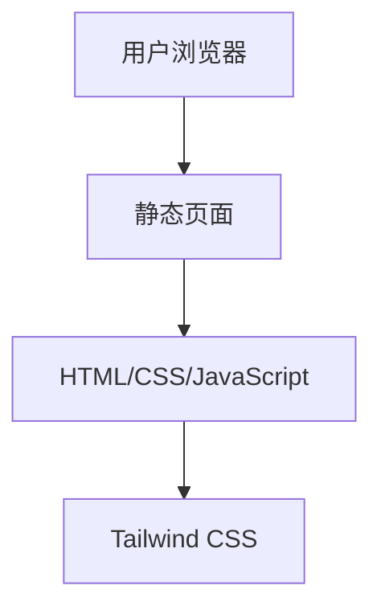

## 1. Architecture Design

## 2. Technology Description
- Frontend: React@18 + tailwindcss@3 + vite
- Initialization Tool: vite-init
- Backend: None (纯静态页面)
- Database: None (纯静态页面)

## 3. Route Definitions
| Route | Purpose |
|-------|---------|
| / | 首页，展示个人信息和课程列表 |

## 4. API Definitions
- 不适用，本项目为纯静态页面，无API调用

## 5. Server Architecture Diagram
- 不适用，本项目为纯静态页面，无服务器架构

## 6. Data Model
- 不适用，本项目为纯静态页面，无数据模型

### 6.1 Data Model Definition
- 不适用

### 6.2 Data Definition Language
- 不适用